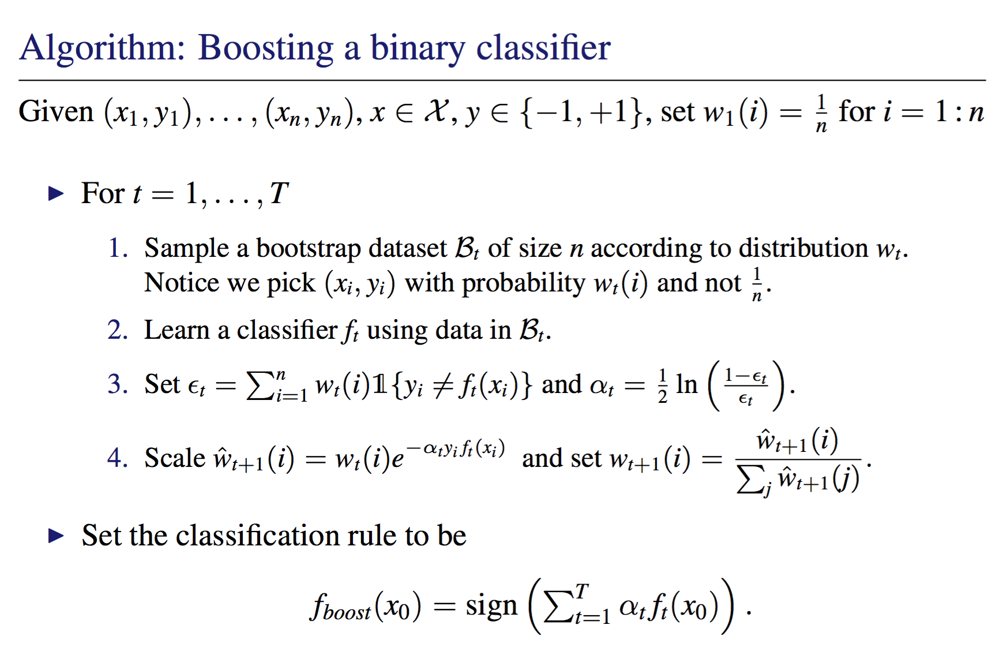

# AdaBoost
Implement boosting for the Least Squares Classifier from scratch

The Least Squares Classifier performed least squares linear regression treating the ±1 labels as real-valued responses. The classifier is generally considered “weak”, and so boosting this classifier can be a good illustration of the method.

## Data

Information about the data used for this problem can be found [here](https://archive.ics.uci.edu/ml/datasets/Occupancy+Detection+)

## Algorithm
